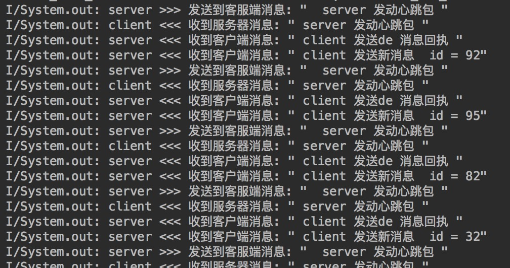

## AndroidSocketChat
> 基于TCP Socket实现数据通信。 此项目主要是安卓端通过socket与服务器通信，为配合测试，写了简单的socketserver服务器代码。

### 部分log日志截图

### Features

- [Android Client 实现](./)
- Java 服务器 module

### Todo-list

- protobuf 自定义消息协议 [参考](http://blog.csdn.net/briblue/article/details/53187780)
- 代码优化完善
- ...

### Thanks
all my friends
