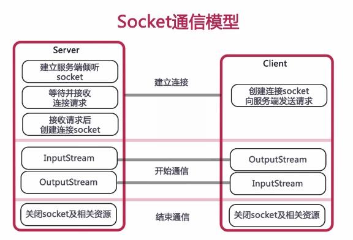

## android socket client 实现


前段时间公司项目有个大版本准备对IM（消息通信）模块升级。虽然需求紧急但server同事任坚持自定义消息协议来实现一套通信框架。这里对Android端实现做下总结，仅供交流。


<h3 id="socket_intro">socket 简介</h3>
>socket就是我们常说的套接字。网络上具有唯一标识的IP地址和端口组合在一起才能构成唯一能识别的标识符套接字。根据不同的的底层协议，Socket的实现是多样化的。常见的Socket类型为流套接字（streamsocket）和数据报套接字(datagramsocket)；数据报套接字使用UDP协议，提供数据打包发送服务。流套接字将TCP作为其端对端协议，提供了一个可信赖的字节流服务。


<h3 id="create">创建连接</h3>

这里给出一个简单通信模型，图片来源于网络。


- sample code **这里只贴出了client端代码**

```  
try {
            LogUtil.d(TAG, " connecting  ip=%s , port = %d", ip, port);
            while (true) {
                try {
                    mSocket = new Socket();
                    mSocket.setKeepAlive(true);
                    mSocket.setSoTimeout(2 * 3 * 60 * 1000);//inputStream read 超时时间
                    mSocket.setTcpNoDelay(true);
                    mSocket.connect(new InetSocketAddress(ip, port));
                    if (mSocket.isConnected()) {
                        dataIS = new DataInputStream(mSocket.getInputStream());
                        dataOS = new DataOutputStream(mSocket.getOutputStream());
                        connectState = true;
                    }
                    this.mCallback.onConnect(this);
                    break;//connect sucess
                } catch (IOException e) {
                    mRetryPolicy.retry(e);
                    //间隔5秒，重连。
                    Thread.sleep(5000);
                    LogUtil.e(TAG, " connect IOException =%s , and retry count = %d", e.getMessage(), mRetryPolicy.getCurrentRetryCount());
                }
            }
        } catch (Exception e) {
            //重试后，仍然失败了。回调失败。
            connectState = false;
            e.printStackTrace();
            LogUtil.e(TAG, " connect IOException = " + e.getMessage());
            mCallback.onConnectFailed(e);
        }

```


<h3 id="receive_msg">接收消息</h3>

创建成功后就开始接收处理消息。

```
while (isConnected()) {
            try {
                int type = dataIS.readByte();//读取1位
                int length = dataIS.readChar();//读取2位标记第三段数据长度
                byte[] data = new byte[length];
                LogUtil.i(TAG, " receiveData connected receiveData type = %d, ", type);
                dataIS.readFully(data);
                mCallback.onReceive(type, data);
            } catch (SocketTimeoutException e) {
                LogUtil.e(TAG, " receiveData SocketTimeoutException = " + e.getMessage());
                e.printStackTrace();
                break;
            } catch (IOException e) {
                LogUtil.e(TAG, " receiveData IOException = " + e.getMessage());
                e.printStackTrace();
                break;//异常后，退出循环
            }
        }
        
        //通知异常，并重连。
```

<h3 id="send_msg">发送消息</h3>

在连接状态下向服务器发送字节流消息。

```
// 1.同步处理 2.异常或未连接状态下，则回调并通知重连
final byte[] bytes = {1,2,3,4,5}; //test data
synchronized (TcpClient.class) {
            if (isConnected()) {
                try {
                    byte type = 1;
                    dataOS.writeByte(type);
                    dataOS.writeChar(bytes.length);
                    dataOS.write(bytes);
                    dataOS.flush();
                    LogUtil.i(TAG, "send success msg : %s", Arrays.toString(bytes));
                } catch (final IOException e) {
                    callback.onFailed(e);
                    disConnect(true);
                    e.printStackTrace();
                }
            } else {
                callback.onFailed(new Exception("socket is not connected"));
                disConnect(true);
                LogUtil.i(TAG, "socket is not connected !");
            }
        }
```

<h3 id="disconnect">断开连接</h3>

```
//关闭流
		closeInputStream(dataIS);
        closeOutputStream(dataOS);
        if (mSocket != null) {
            try {
                mSocket.shutdownInput();
                mSocket.shutdownOutput();
                mSocket.close();
                mSocket = null;
            } catch (Exception e) {
                e.printStackTrace();
            }
        }
        if (mCallback != null && needRec) {
            mCallback.onDisconnect();
        }
        mState = STATE_DISCONNECT;
```


<h3 id="gray_service">进度灰色保活</h3>

由于项目中通信模块运行在独立的进程中，为避免进程被意外干掉，这里将其优先级提高已达到报活效果。

```
if (Build.VERSION.SDK_INT < 18) {//18以下，可直接设置为前台service
            startForeground(GRAY_SERVICE_ID, new Notification());
        } else if (Build.VERSION.SDK_INT <= 24) {
            Intent innerIntent = new Intent(this, GrayInnerService.class);
            startService(innerIntent);
            startForeground(GRAY_SERVICE_ID, new Notification());
        }
```

在看看GrayInnerService实现

```
/**
     * 测试结果：API<=24可行。25/7.1.1版本，通知栏正常状态下看不到icon，但滑下来就看得到icon。
     * 给 API >= 18 的平台上用的灰色保活手段
     */
    public static class GrayInnerService extends Service {

        @Override
        public int onStartCommand(Intent intent, int flags, int startId) {
            startForeground(GRAY_SERVICE_ID, new Notification());
            stopSelf();
            return super.onStartCommand(intent, flags, startId);
        }

        @Nullable
        @Override
        public IBinder onBind(Intent intent) {
            return null;
        }

    }
```
代码中可以看出，启动一个相同id的前台GrayInnerService然后立即stopSelf，再以同样方式启动主service，这样运行起来的service就已经是达到前台服务优先级了，一般情况都杀不了它。


<h3 id="ipc">IPC</h3>

这里IPC比较简单，就是使用bundle实现service到broadcast之间的跨进程通信。此处略过，详细请查看代码。


<h3 id="custom_broadcast">自定义广播权限</h3>

> 出于安全考虑或者其它特殊需求，可能会限制广播接收者，所以这里就用到了自定义权限。

- manifest.xml中定义并使用

```
<permission
        android:name="android.intent.permission.im.receiver_permission"
        android:protectionLevel="normal" />

    <uses-permission android:name="android.intent.permission.im.receiver_permission" />
    
```
- 发送带权限的广播

```
contexts.sendBroadcast(intent, "android.intent.permission.im.receiver_permission");
```
这样只有申明了此权限的广播才能接收到消息。


<h3 id="retry">重试机制</h3>

这里参考volley框架的重试机制，在创建连接时若失败5次之内会尝试重连。具体实现请参考DefaultRetryPolicy类。


<h3 id="catch_crash">进程异常恢复</h3>

实现Thread.UncaughtExceptionHandler接口，处理异常并恢复。

```
@Override
    public void uncaughtException(Thread thread, Throwable ex) {
        // crash统计打点
        if (ex != null) {
            ex.printStackTrace();
            // 保存错误报告文件
            saveCrashInfoToFile(ex);
        }
        try {
            Thread.sleep(1000);
        } catch (InterruptedException e) {
            e.printStackTrace();
        }
        LogUtil.i(TAG, "uncaughtException crash recovering");
        // 检查socket状态并重连
        ImServiceHelper.getInstance(mContext).reConnect();
    }
```

### 补充

- 弱网情况。
   目前弱网情况未做处理，超时异常会捕获，然后进入重连机制。
   给个处理建议：将所有未发送成功的请求缓存到队列，待网络恢复后自动发送。
- 连接异常断开，如何恢复。
   除了上面提到了链接重试，及进程异常恢复；代码中捕获了任何socket异常，并进入重连机制。
- 健壮的心跳策略。
心跳策略最好是双向的，及服务器和客户端都应有心跳。
由于demo代码这块没完善，这里简单说下实现思路： **空闲状态，每三分钟发送一个心跳包。**
    server每三分钟发一次心跳"ping"到client，client收到后回发一
    个"pong"给server，这就完成了一次心跳检测。但如果在这三分钟之
    内收到client发来的数据，则证明长连接处于正常状态，需要重新记
    时三分钟再发送心跳。 **client处理策略可以和server一致。**

### 参考

- [关于service的一切](http://blog.csdn.net/guolin_blog/article/details/11952435/)
- [进程保活](http://geek.csdn.net/news/detail/68515)
- [基于Android的socket通信](http://blog.csdn.net/maoxiao1229/article/details/22886337)
- [官方api等资料]()
